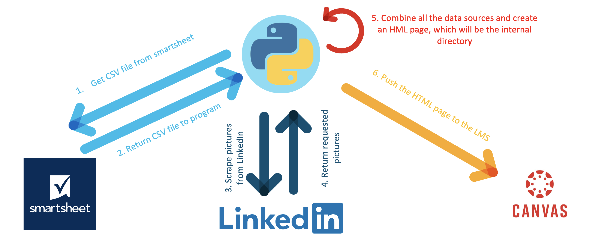
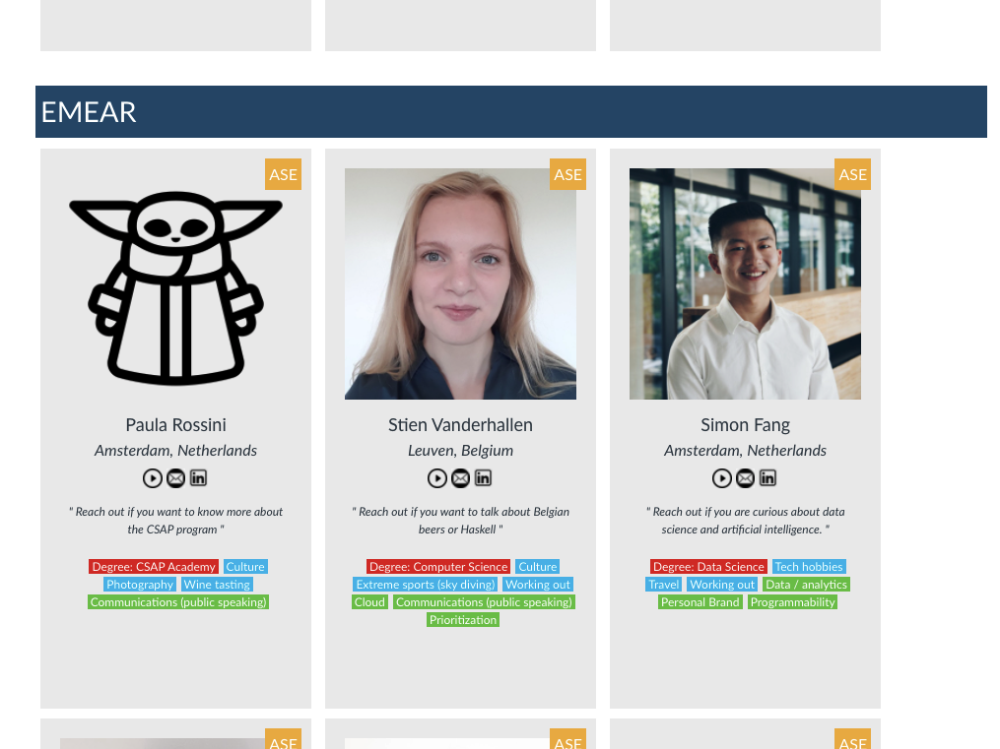
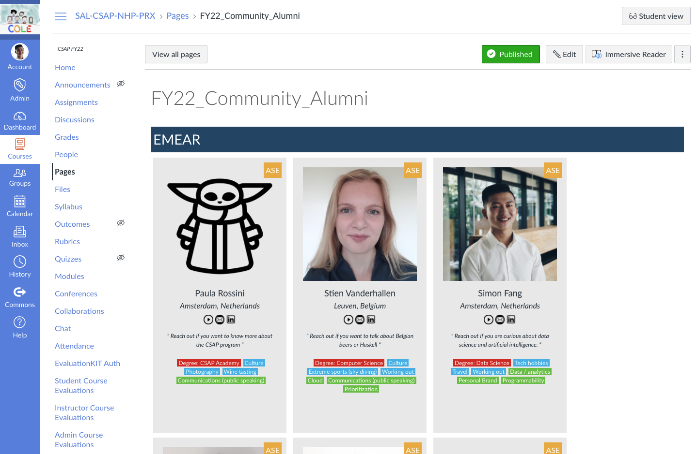

# GVE DevNet LMS Page Automation

In this repository, we show how we can automatically obtain data from smartsheet and use this data to turn into a profiles page on an LMS. Moreover, we obtain photos from the users through Linkedin. 

## Contacts
* Stien Vanderhallen (stienvan@cisco.com)
* Simon Fang (sifang@cisco.com)

## Solution Components
* Python
* HTML
* Smartsheet API
* Canvas LMS API

## Flow

In this section, we will explain the flow of the script:

1. In the first step, we will make a call to the Smartsheet API to obtain the CSV file. 

2. The Smartsheet API returns the CSV file

3. Then, we scrape pictures from LinkedIn using the `selenium webdriver`

4. We obtain the pictures and save them

5. The script combines the different data sources together and creates an HTML pages, which will be the internal directory

6. We push the HTML page to the LMS using its API



## Smartsheet token

How to obtain a Smartsheet Token for API access:

1. Log on to Smarsheet

2. In the `Account` menu on the bottom left, select the `Apps & Integrations...` option. 

3. In the `Personal Settings` window, select the `API Access` option in the menu to the left. 

4. Under `Manage API Access Tokens`, click the `Generate new access token` button. 

5. Name your new access token and click `OK`.

6. Copy and paste the `Access Token` and store it somewhere safe! For security reasons, it will only be displayed once. In case you lose it, then you will have to regenerate it following steps 1 to 5. 

## LMS token

1. Log on to Canvas LMS

2. In the `Account` menu on the top left, select the `Settings` option. 

3. Scroll down to the section `Approved integrations` and click on `New access token` to generate a new API token. 

4. In the new window `New access token`, fill in the purpose of the token and an optional expiration date (leave blank for no expiration)

5. Click `Generate token`

6. In the new window `Access token details`, copy the token and save it somewhere safe. For security reasions, it will only be displayed once. In case you lose it, then you will have to regenerate it following steps 1 to 5. 

## Installation

The following commands are executed in the terminal. 

1. Create and activate a virtual environment for the project:
   
        #WINDOWS:
        $ py -3 -m venv [add_name_of_virtual_environment_here] 
        $ [add_name_of_virtual_environment_here]/Scripts/activate
        #MAC:
        $ python3 -m venv [add_name_of_virtual_environment_here] 
        $ source [add_name_of_virtual_environment_here]/bin/activate

> For more information about virtual environments, please click [here](https://docs.python.org/3/tutorial/venv.html)

2. Access the created virutal environment folder

        $ cd [add_name_of_virtual_environment_here]

3. Clone this repository

        $ git clone [add_link_to_repository_here]
        
4. Access the folder `gve_devnet_LMS_page_automation`

        $ cd gve_devnet_LMS_page_automation

5. Open the `configy.py` file and add the following information:
    
    ```python
    from alumni.main import COLE_PAGE_TITLE


    CSV_FILE_NAME = "Your CSV file name"
    HTML_FILE_NAME = "Your COLE HTML file name"

    SMARTSHEET_ACCESS_TOKEN = "Your Smartsheet access token"
    SMARTSHEET_SHEET_ID = "Your Smartsheet ID (integer)"

    COLE_ACCESS_TOKEN = "Your COLE access token"
    COLE_URL = "Your COLE page URL"
    COLE_PAGE_TITLE = "Your COLE page title"

    LINKEDIN_EMAIL = "An e-mailaddress linked to a LinkedIn profile"
    LINKEDIN_PASSWORD = "The password for the LinkedIn profile"

    CHROMEDRIVER_PATH = "File path to your chromedriver executable file"
    ```

6. In a terminal, install the requirements with `pip install -r requirements.txt`.


## Usage

To run the script, use the following command:

    $ python main.py

After successful completion of the script, you can find the final result in your LMS. For an example, please see the screenshots below. 


# Screenshots




### LICENSE

Provided under Cisco Sample Code License, for details see [LICENSE](LICENSE.md)

### CODE_OF_CONDUCT

Our code of conduct is available [here](CODE_OF_CONDUCT.md)

### CONTRIBUTING

See our contributing guidelines [here](CONTRIBUTING.md)

#### DISCLAIMER:
<b>Please note:</b> This script is meant for demo purposes only. All tools/ scripts in this repo are released for use "AS IS" without any warranties of any kind, including, but not limited to their installation, use, or performance. Any use of these scripts and tools is at your own risk. There is no guarantee that they have been through thorough testing in a comparable environment and we are not responsible for any damage or data loss incurred with their use.
You are responsible for reviewing and testing any scripts you run thoroughly before use in any non-testing environment.
